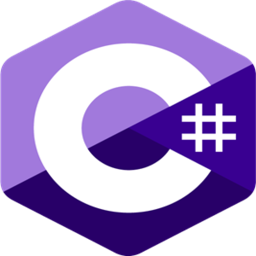
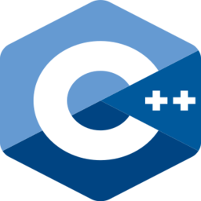
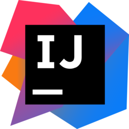
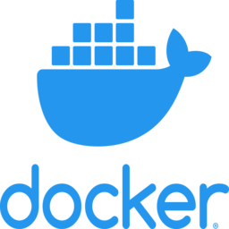
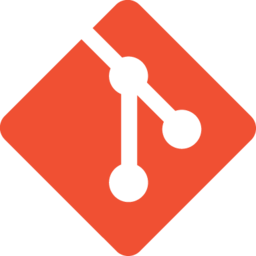
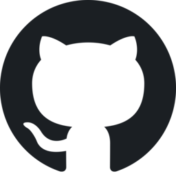
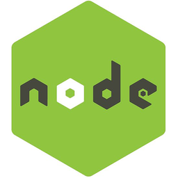

## Hi, I’m Ab20zip! 

- I’m a 16-year-old developer from India.
- My pronouns are he/him.
- My name when pronounced, sounds like "Ayy bee. Twenty zip."
- My favorite languages: are Java, Kotlin, JavaScript (mostly with Node.js), and PHP.
- Most of my official work can be found [here](https://github.com/altiran).

#### 👉 Social Links

[![Website Badge](https://img.shields.io/badge/-Ab20zip-029292?style=flat-square&logo=data:image/svg+xml;base64,PD94bWwgdmVyc2lvbj0iMS4wIiBlbmNvZGluZz0iaXNvLTg4NTktMSI/Pg0KPCEtLSBVcGxvYWRlZCB0bzogU1ZHIFJlcG8sIHd3dy5zdmdyZXBvLmNvbSwgR2VuZXJhdG9yOiBTVkcgUmVwbyBNaXhlciBUb29scyAtLT4NCjxzdmcgZmlsbD0iI2ZmZmZmZiIgaGVpZ2h0PSI4MDBweCIgd2lkdGg9IjgwMHB4IiB2ZXJzaW9uPSIxLjEiIGlkPSJMYXllcl8xIiB4bWxucz0iaHR0cDovL3d3dy53My5vcmcvMjAwMC9zdmciIHhtbG5zOnhsaW5rPSJodHRwOi8vd3d3LnczLm9yZy8xOTk5L3hsaW5rIiANCgkgdmlld0JveD0iMCAwIDUxMiA1MTIiIHhtbDpzcGFjZT0icHJlc2VydmUiPg0KPGc+DQoJPGc+DQoJCTxwYXRoIGQ9Ik0yNTYsMEMxMTQuNjIsMCwwLDExNC42MiwwLDI1NnMxMTQuNjIsMjU2LDI1NiwyNTZzMjU2LTExNC42MiwyNTYtMjU2UzM5Ny4zOCwwLDI1NiwweiBNMTcyLjIxMSw0MS42MDkNCgkJCWMtMjQuOTM0LDI3LjExOS00NC42OCw2Ni4xMjUtNTYuNzU1LDExMS45OTJINDkuNzQ5Qzc1LjE3OSwxMDIuNzQxLDExOC44NjksNjIuNTI0LDE3Mi4yMTEsNDEuNjA5eiBNMjUuNiwyNTYNCgkJCWMwLTI2Ljk5OSw1LjA3Ny01Mi43MjcsMTMuNjYyLTc2LjhoNzAuNDk0Yy00LjYwOCwyNC4yOTQtNy4zNTYsNDkuOTYzLTcuMzU2LDc2LjhzMi43NDgsNTIuNTA2LDcuMzQ3LDc2LjhIMzkuMjYyDQoJCQlDMzAuNjc3LDMwOC43MjcsMjUuNiwyODMsMjUuNiwyNTZ6IE00OS43NDksMzU4LjRoNjUuNzA3YzEyLjA4Myw0NS44NjcsMzEuODIxLDg0Ljg3Miw1Ni43NTUsMTExLjk5MQ0KCQkJQzExOC44NjksNDQ5LjQ3Niw3NS4xNzksNDA5LjI1OSw0OS43NDksMzU4LjR6IE0yNDMuMiw0ODUuMTg4Yy00My44MS04LjI1Mi04MS44NzctNTguMjQtMTAxLjM1OS0xMjYuNzg4SDI0My4yVjQ4NS4xODh6DQoJCQkgTTI0My4yLDMzMi44SDEzNS43NGMtNC45MjQtMjQuMTY2LTcuNzQtNDkuOTk3LTcuNzQtNzYuOHMyLjgxNi01Mi42MzQsNy43NC03Ni44SDI0My4yVjMzMi44eiBNMjQzLjIsMTUzLjZIMTQxLjg0MQ0KCQkJQzE2MS4zMjMsODUuMDUyLDE5OS4zOSwzNS4wNjMsMjQzLjIsMjYuODEyVjE1My42eiBNNDYyLjI1MSwxNTMuNmgtNjUuNzA3Yy0xMi4wODMtNDUuODY3LTMxLjgyMS04NC44NzMtNTYuNzU1LTExMS45OTINCgkJCUMzOTMuMTMxLDYyLjUyNCw0MzYuODIxLDEwMi43NDEsNDYyLjI1MSwxNTMuNnogTTI2OC44LDI2LjgxMmM0My44MSw4LjI1Miw4MS44NzcsNTguMjQsMTAxLjM1OSwxMjYuNzg4SDI2OC44VjI2LjgxMnoNCgkJCSBNMjY4LjgsMTc5LjJoMTA3LjQ2YzQuOTI0LDI0LjE2Niw3Ljc0LDQ5Ljk5Nyw3Ljc0LDc2LjhzLTIuODE2LDUyLjYzNC03Ljc0LDc2LjhIMjY4LjhWMTc5LjJ6IE0yNjguOCw0ODUuMTg4VjM1OC40aDEwMS4zNTkNCgkJCUMzNTAuNjc3LDQyNi45NDgsMzEyLjYxLDQ3Ni45MzcsMjY4LjgsNDg1LjE4OHogTTMzOS43ODksNDcwLjM5MWMyNC45MzQtMjcuMTI3LDQ0LjY3Mi02Ni4xMjUsNTYuNzU1LTExMS45OTFoNjUuNzA3DQoJCQlDNDM2LjgyMSw0MDkuMjU5LDM5My4xMzEsNDQ5LjQ3NiwzMzkuNzg5LDQ3MC4zOTF6IE00MDIuMjQ0LDMzMi44YzQuNjA4LTI0LjI5NCw3LjM1Ni00OS45NjMsNy4zNTYtNzYuOA0KCQkJcy0yLjc0OC01Mi41MDYtNy4zNDctNzYuOGg3MC40OTRjOC41NzYsMjQuMDczLDEzLjY1Myw0OS44MDEsMTMuNjUzLDc2LjhjMCwyNy01LjA3Nyw1Mi43MjctMTMuNjYyLDc2LjhINDAyLjI0NHoiLz4NCgk8L2c+DQo8L2c+DQo8L3N2Zz4=&link=https://altiran.com/Ab20zip)](https://altiran.com/Ab20zip)

#### 👩🏾‍💻 Programming Languages I Use

)

 
 

#### ⚡ Technologies and Tools I Use

 
 

#### 🟢 Currently Working On

#### ▶️ Latest YouTube Videos
<!-- YOUTUBE:START --><table><tr><td></td>
<td><a href="https://www.youtube.com/watch?v=T5sngsQQU5k">EXTREME CAR DRIVING SIMULATOR GAMEPLAY #1 | 500+ km/h SPEED</a> Dec 9, 2021</td></tr></table>
<table><tr><td></td>
<td><a href="https://www.youtube.com/watch?v=zR3nFfcIrKg">They hackusated me | Ab20zipYT</a> Aug 6, 2021</td></tr></table>
<table><tr><td></td>
<td><a href="https://www.youtube.com/watch?v=YSYqIiExAOM">Uncut bedwars</a> Jul 21, 2021</td></tr></table>
<table><tr><td></td>
<td><a href="https://www.youtube.com/watch?v=tvJOP1T-Lk0">A Normal Bedwars Game</a> Jul 21, 2021</td></tr></table>
<!-- YOUTUBE:END -->

#### 📫 How to Reach Me
- You can add me on Discord (ab20zip) or join [our official Discord Server](https://discord.gg/jsSGFeR).
- If you have a question/problem directly relating to one of my projects, you can open an issue in that repository.
- Email address for official communication: [contact@altiran.com](mailto:contact@altiran.com).

#### 📈 GitHub Info

